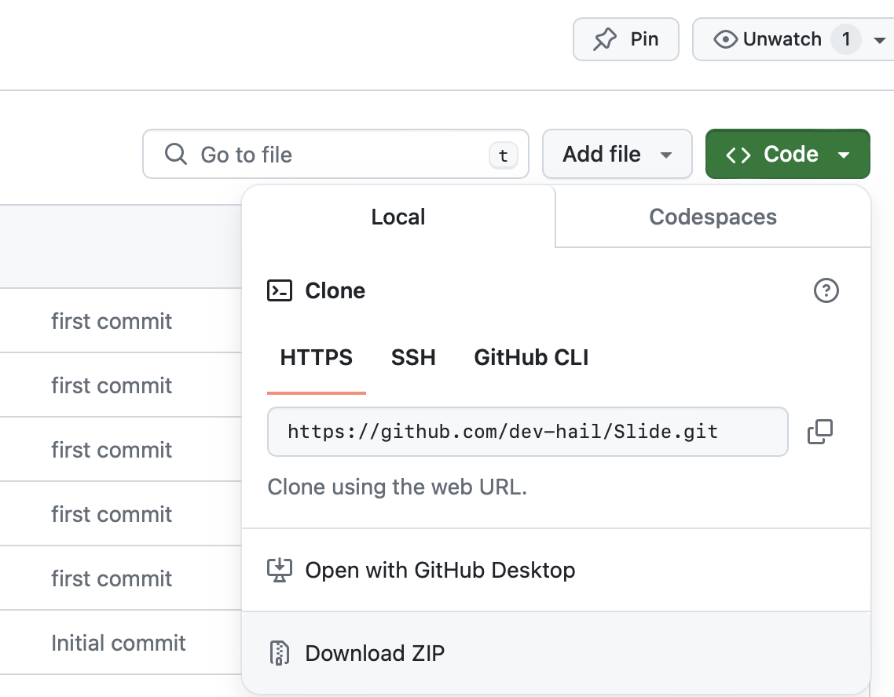

# Slide
Slide is a chrome extension built to replace Chrome's home screen with a more customizable and refreshing look.

> ## Step 1

Download the zip file. Unzip / Extract it to desired location.

> ## Step 2

Open Chrome. Click the 3 dots on the top right.
-> Extensions -> Manage Extensions

> ## Step 3

Toggle the Developer Mode On if its off. "Load Unpack" option will be now available. Click on it.
Select the extracted FOLDER.

